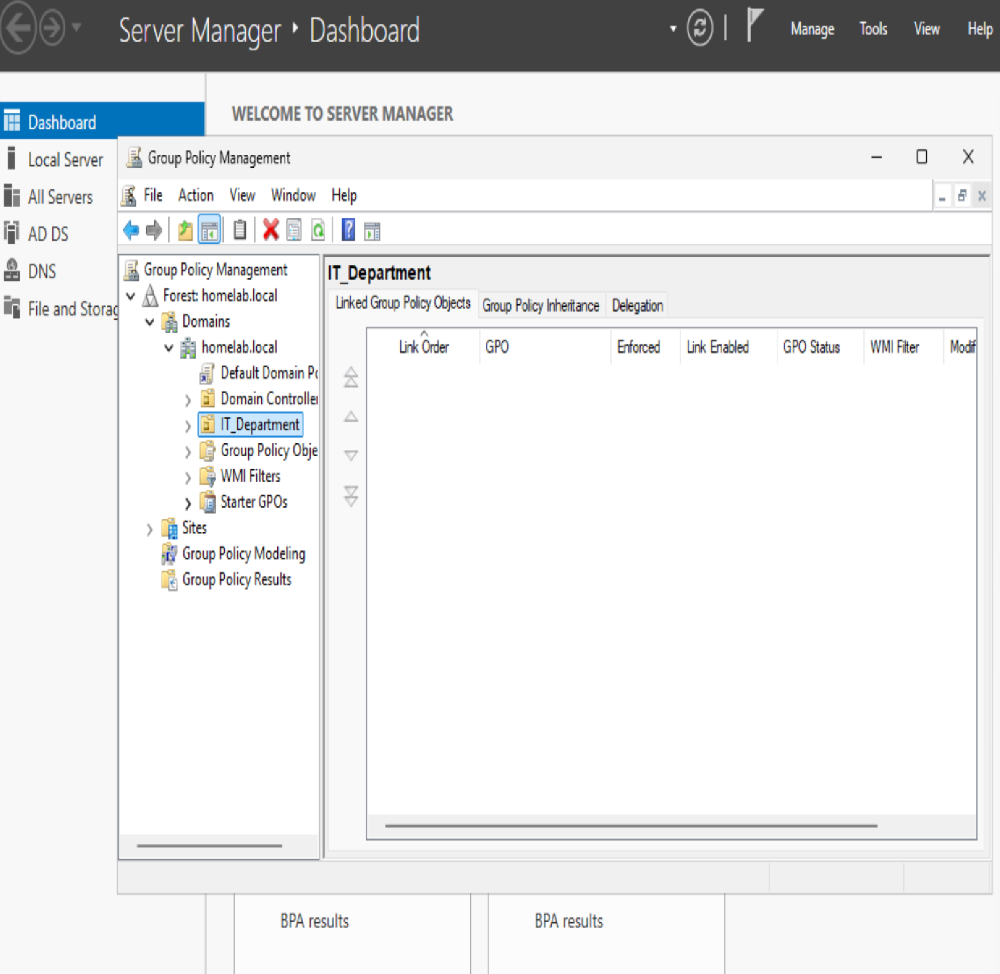
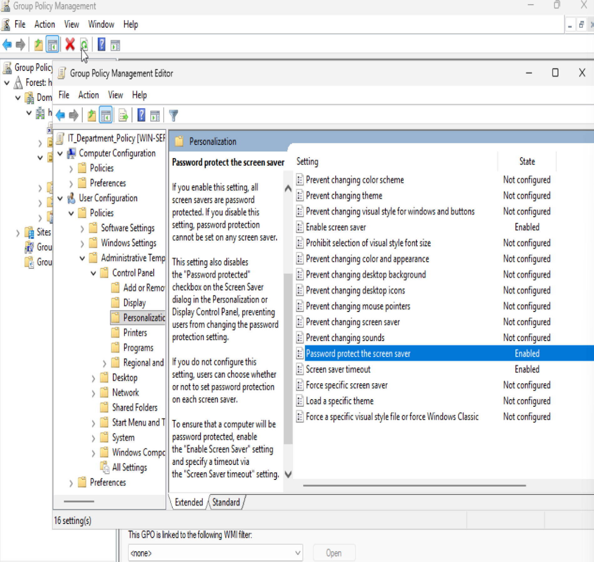
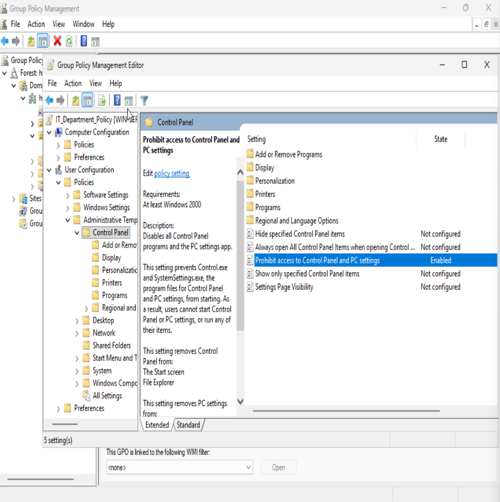
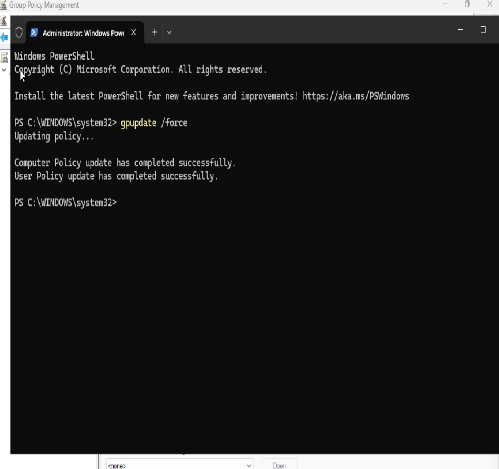
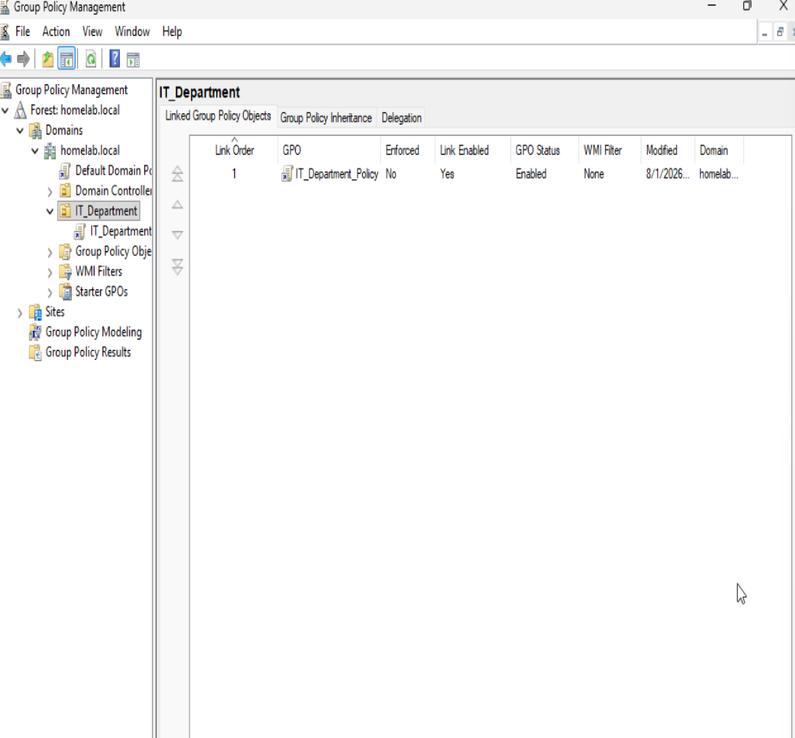
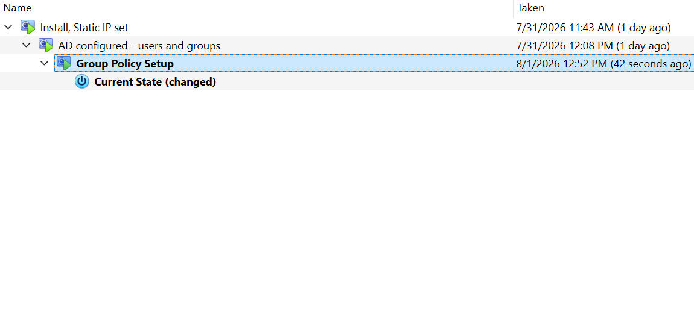

# Group Policy Management setup

With the IT_Department OU created, I set about implementing Group Policy Management.

## Creating and setting IT department policy

First, before creating the GPO, I find my IT_Department OU in Group Policy.

After creating a Group Policy Object (GPO) linked to IT_Department, called IT_Department_Policy, I enable settings requiring a screen saver after inactivity, and requiring password protection on the screen saver, preventing walk up access when the machine has been left unattended.

Next I disable access to the control panel for members of IT_Department. This will help maintain standardized machine configurations, and heighten security by preventing access to firewall, security and account settings on the user-level.

## Forcing Group Policy update and verifying

After that, I use PowerShell to force the policy into effect immediately.

And verify that GPO is enabled.

Finally, as always at the end of a lab, I take a snapshot in Virtualbox.

