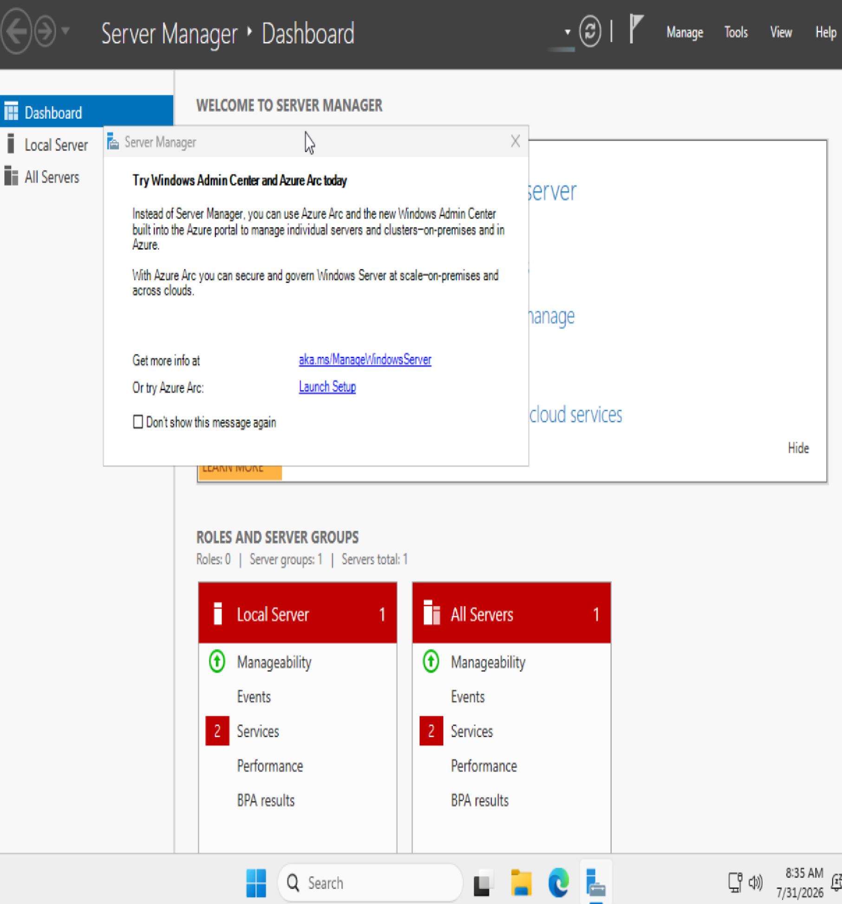
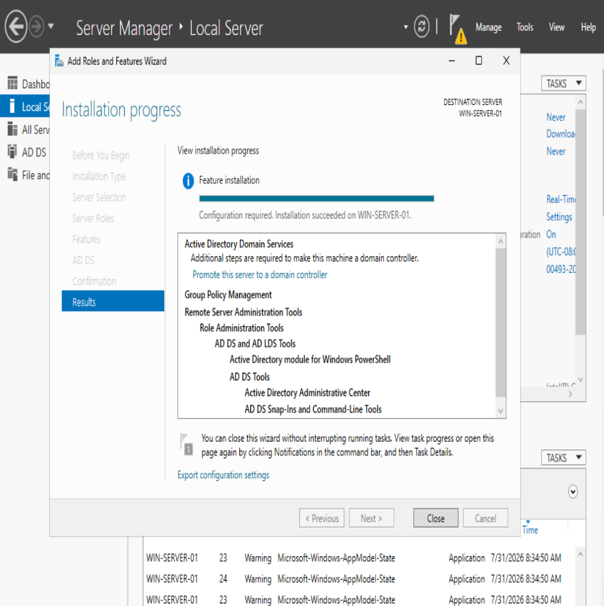
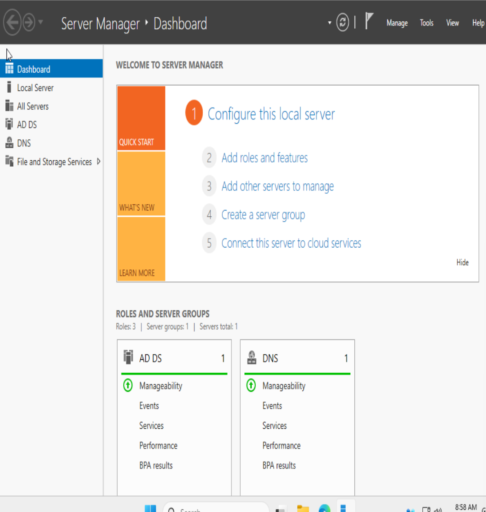
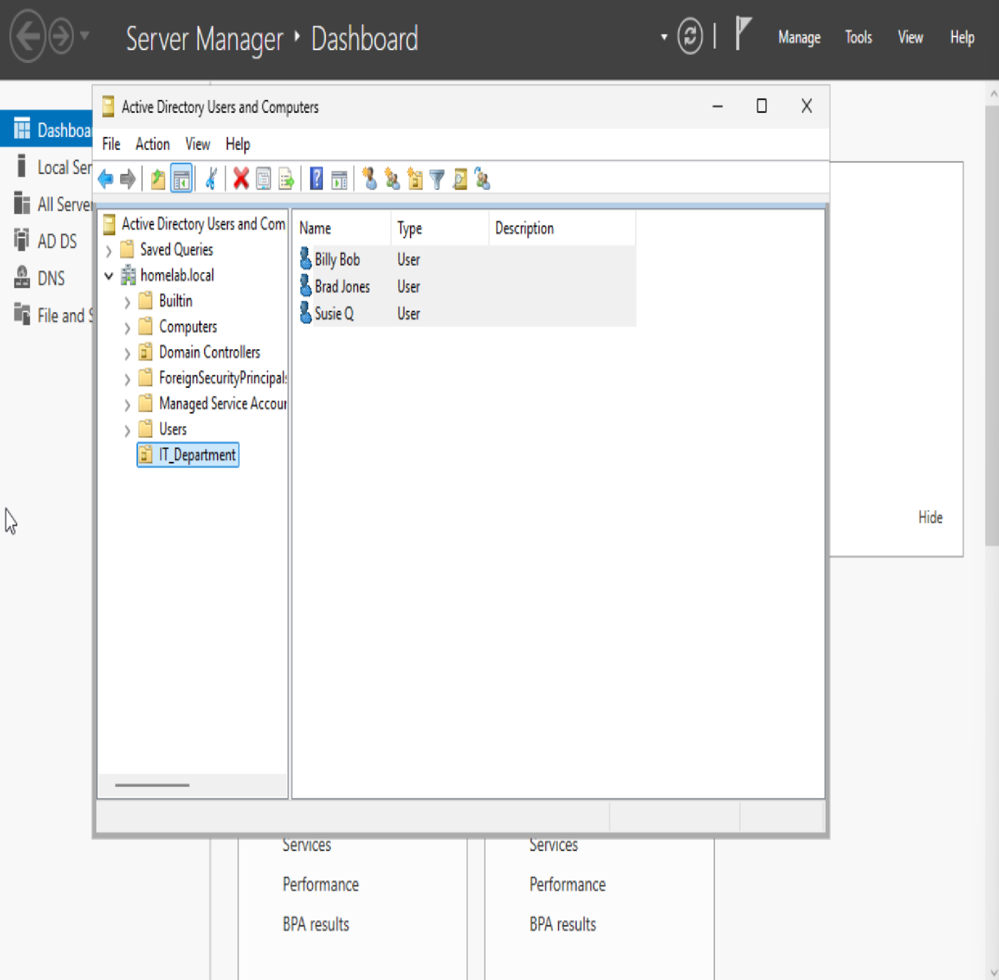
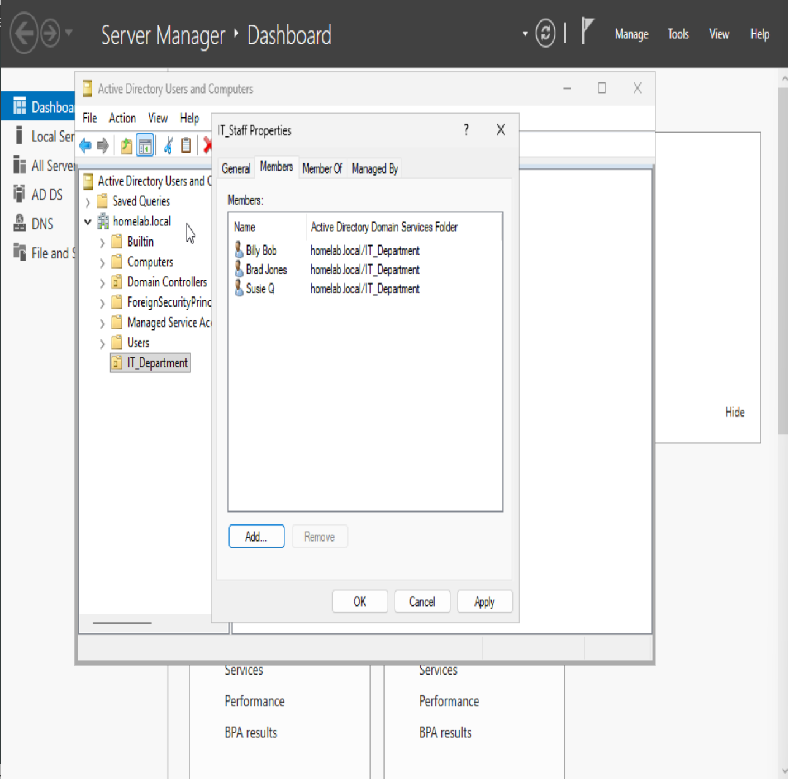
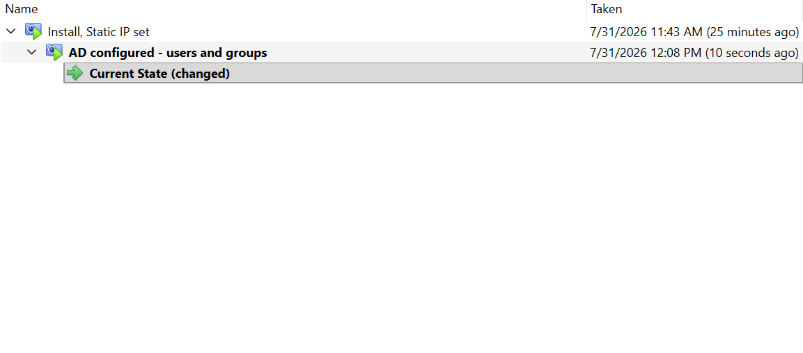

# Setting up Windows Server and Active Directory through Virtualbox

## Getting the server up

First I install Windows Server through Virtualbox, allocating appropriate resources and verifying that it's operational.

## Setting up Active Directory

After setting one of my network adapters to a static IP (for consistent SSH/RDP access to the VM), I install Active Directory and promote my VM to domain controller.

The VM restarts and I verify that Active Directory is installed.

## Creating Organizational Unit and Users and assigning them to a group

Next I create an Organizational Unit called IT_Department within active directory, and three users within it.

After that, I create a group within IT_Department called IT_Staff and assign the users to it.

## Snapshotting the VM

With Windows Server up and running, Active Directory installed, and an OU created with users assigned to a group, I snapshot the VM through Virtualbox to allow an easy rollback to this state.

