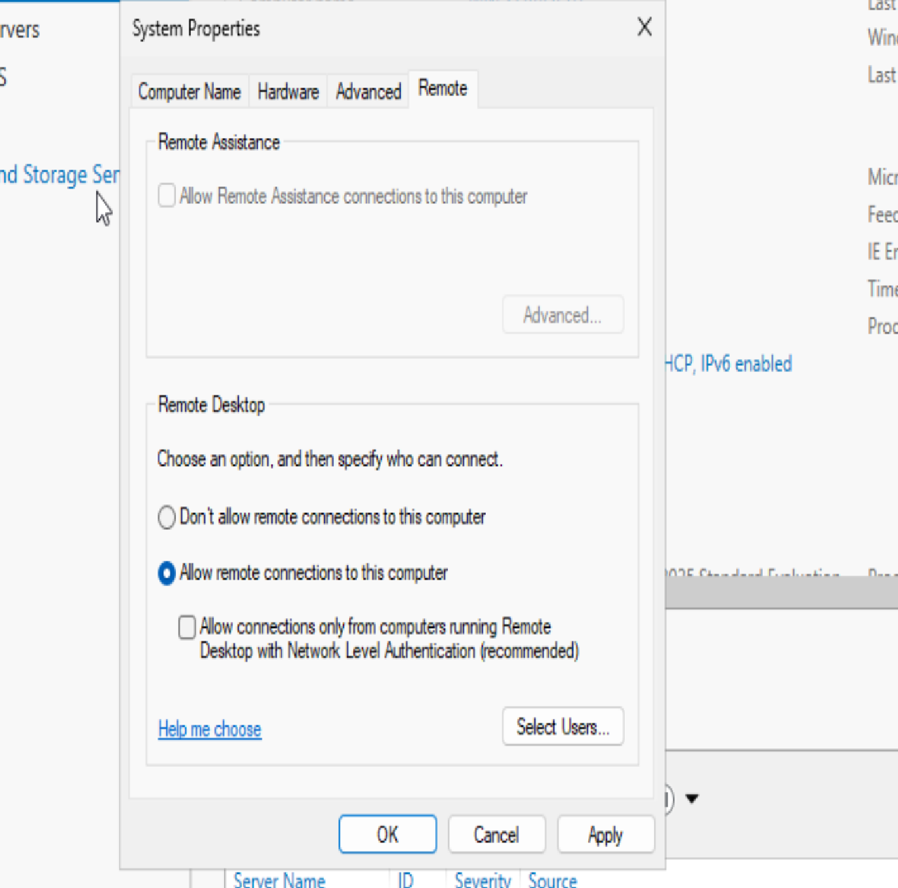
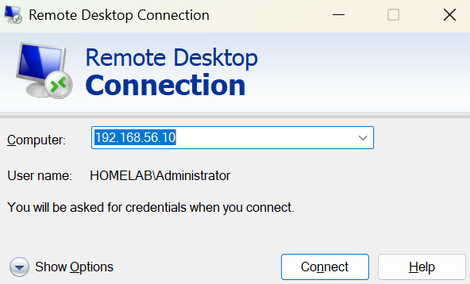
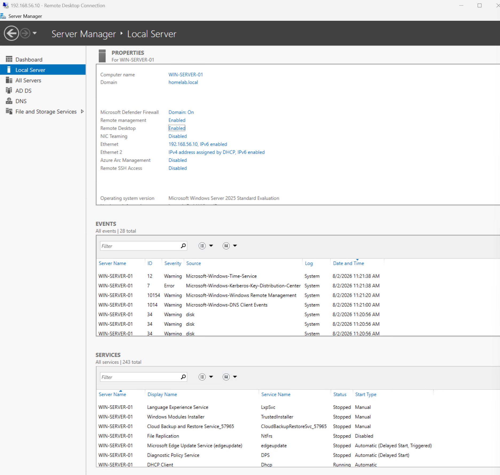
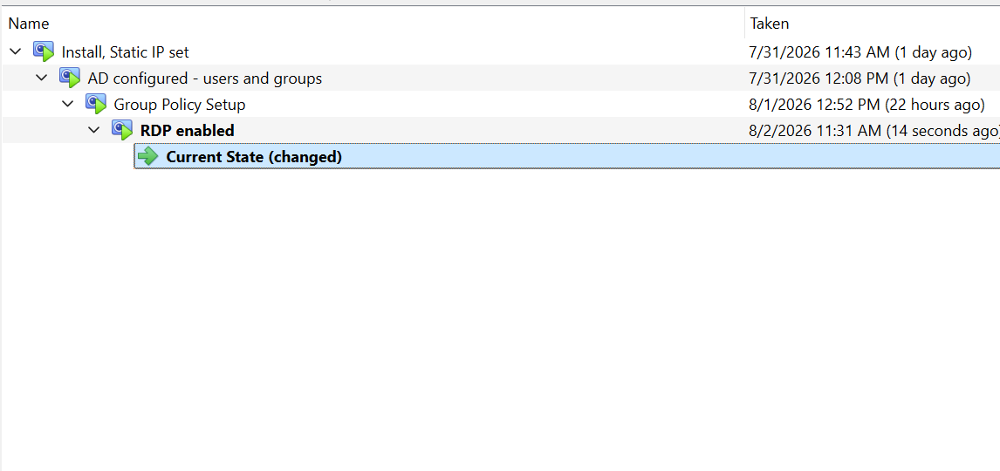

# RDP Setup and Connection

A short lab in which I enable Remote Desktop access to my virtual server, and successfully connect via RDP on my host machine.

## Enabling and connecting

First I enable Remote Desktop connections in my server through virtualbox.

Next I boot up Remote Desktop Connection on my host OS.

I successfully connect with RDP.

Lastly, as always, I take a snapshot through Virtualbox

